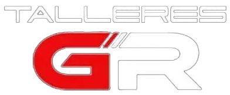

  🌍 Available in: <a href="README.md"> English</a>

# 🛠️ **TalleresGR** – *Sitio Web para Taller Automotriz*

  

&nbsp;

  
  
  
  
  
  
  

---

## 🚗 ¿Qué es *TalleresGR*?

**TalleresGR** es un sitio web moderno y atractivo que representa una **empresa de servicios automotrices**. Desarrollado con **HTML5**, **CSS3** y **JavaScript**, ofrece una experiencia visual fluida y profesional gracias a **ScrollReveal.js** y permite el envío de formularios a través de **EmailJS** sin necesidad de un servidor.

---

## 🌟 Características Principales

✅ **Diseño adaptable**: se adapta perfectamente a móviles, tablets y PCs.  
✨ **Animaciones fluidas** con **ScrollReveal.js** para una navegación atractiva.  
📬 **Formulario de contacto funcional** usando **EmailJS**, sin backend.  
🧭 Secciones informativas bien definidas:
- 🏠 **Inicio**
- 🧑‍🔧 **Quiénes Somos**
- 🔧 **Servicios** (mecánica, mantenimiento, diagnóstico, etc.)
- 📞 **Contacto**

---

## 🧰 Tecnologías Utilizadas

| Tecnología | Descripción |
|------------|-------------|
| **HTML5**  | Estructura semántica y accesible. |
| **CSS3**   | Estilos modernos y responsivos. |
| **JavaScript** | Funcionalidad dinámica del sitio. |
| **ScrollReveal.js** | Animaciones al hacer scroll. |
| **EmailJS** | Envío directo de formularios a correo electrónico. |

---

## 🎨 Vista Previa

  

---

## 🎯 Objetivo del Proyecto

Diseñar una **presencia digital profesional** para la empresa TalleresGR, con el fin de atraer nuevos clientes mediante un sitio claro, moderno y atractivo.

---

## 📁 Estructura del Proyecto
**📦 talleresgr/**  
├── 📄 `index.html`  
├── 📁 `assets/`  
│   ├── 📁 `images/`  
│   ├── 📁 `scripts/`  
│   │   ├── 📄 `active-link.js`  
│   │   ├── 📄 `blur.js`  
│   │   ├── 📄 `form.js`  
│   │   ├── 📄 `loadmore.js`  
│   │   ├── 📄 `navbar.js`  
│   │   ├── 📄 `scrollreveal.js`  
│   │   ├── 📄 `scrollup.js`  
│   ├── 📁 `templates/`  
│   │   └── 📄 `scrollreveal.min.js`  
│   └── 📄 `stylesheet.css`  

---

## 👨‍💻 Autor y Licencia

Proyecto desarrollado por **Walther Saavedra** a solicitud del propietario del sitio web.

### © Derechos de Autor  
Todo el contenido de este proyecto (código, imágenes y estilos) está protegido por derechos de autor.  
© 2025 TalleresGR. Todos los derechos reservados.

### 🛡️ Licencia Apache 2.0

Este proyecto se encuentra bajo la licencia **Apache 2.0**, lo que permite su uso, modificación y distribución libre, siempre que se respeten los avisos de copyright.

🔗 Consulta el archivo [`LICENSE`](LICENSE) para más información.
