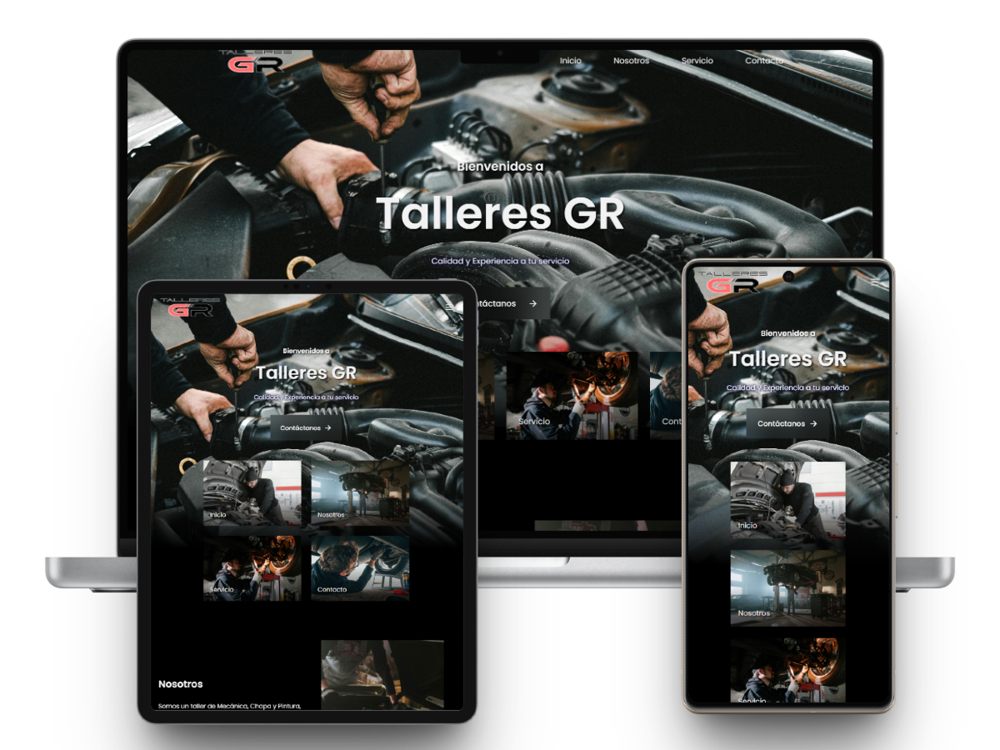

# 🛠️ TalleresGR - Automotive Workshop Website

[Versión en español](README-es.md)

Welcome to the repository for **TalleresGR**, a modern and attractive website designed to represent a **professional automotive workshop**. Developed with **HTML, CSS, and JavaScript**, and enhanced with smooth animations using **ScrollReveal.js**. **EmailJS** has also been implemented for sending contact form submissions directly via email without the need for a backend.

---

## 🚗 Project Description

**TalleresGR** is a static website with a responsive design that aims to present the services of an automotive workshop in a clear and visual manner. The main focus is to combine a professional aesthetic with dynamic transitions that enhance the user experience.

---

## 🌐 Technologies Used

- 🧱 **HTML5** – Semantic content structure.
- 🎨 **CSS3** – Modern and adaptive styles.
- ⚙️ **JavaScript** – Dynamic functionalities.
- ✨ **ScrollReveal.js** – Scroll animations for a more attractive navigation.
- 📧 **EmailJS** – Sending contact form submissions directly to email without a server.

---

## 🎯 Key Features

- **Responsive** design, compatible with mobile, tablet, and desktop devices.
- Informative sections:
  - 📄 Home (main screen to introduce the user)
  - ✅ About Us (who we are)
  - 🔧 Services (mechanics, maintenance, diagnostics, etc.)
  - 📬 Contact Form
- Attractive visual transitions in each section thanks to **ScrollReveal**.
- Sending messages from the contact form using **EmailJS** quickly and securely.

---

## 🎨 Preview

---

## 🚀 Objective

The objective of the project is to create a **professional digital presence** for the TalleresGR automotive workshop, facilitating the attraction of new clients through a modern, informative, and visually appealing design.

---

## 📁 Project Structure

**📦 talleresgr/**  
├── 📄 `index.html`  
├── 📁 `assets/`  
│   ├── 📁 `images/`  
│   ├── 📁 `scripts/`  
│   │   ├── 📄 `active-link.js`  
│   │   ├── 📄 `blur.js`  
│   │   ├── 📄 `form.js`  
│   │   ├── 📄 `loadmore.js`  
│   │   ├── 📄 `navbar.js`  
│   │   ├── 📄 `scrollreveal.js`  
│   │   ├── 📄 `scrollup.js`  
│   ├── 📁 `templates/`  
│   │   └── 📄 `scrollreveal.min.js`  
│   └── 📄 `stylesheet.css`  

---

## 📌 Credits and License

Project developed by **Walther Saavedra** as part of the requirements by the page owner.

### © Copyright

All content of this project (code, images, and styles) is protected by copyright.
© 2025 TalleresGR. All rights reserved.

### 📝 License

This project is distributed under the **Apache License**.
This means you can use, modify, and distribute the code freely, as long as you maintain the original copyright notices.

For more details, see the [`LICENSE`](LICENSE) file.